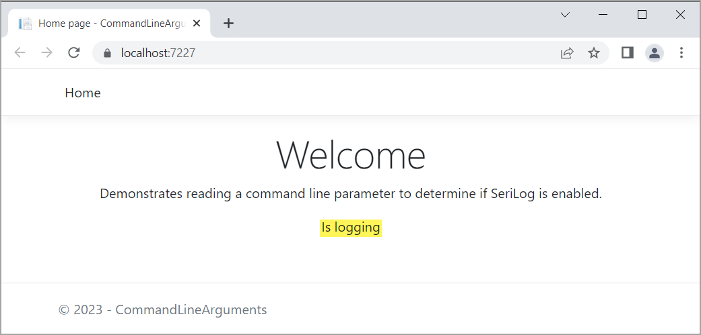

# About

Demonstrates reading a command line parameter to determine if SeriLog is enabled.

Pass `--log true` to use SeriLog, if not passed logging is not enabled.

In Program.cs

```csharp
Appsettings.Instance.UseSeriLog = config.GetValue<bool>("log");
SetupLogging.Development(Appsettings.Instance.UseSeriLog);
```

Appsettings class

```csharp
public sealed class Appsettings
{
    private static readonly Lazy<Appsettings> Lazy = new(() => new Appsettings());
    public static Appsettings Instance => Lazy.Value;
    public bool UseSeriLog { get; set; }
}
```


This is mainly for development rather than production which normally would be logging.

Index page

```csharp
public class IndexModel : PageModel
{
    private readonly ILogger<IndexModel> _logger;

    [BindProperty]
    public string Message { get; set; }
    public IndexModel(ILogger<IndexModel> logger)
    {
        _logger = logger;
    }

    public void OnGet()
    {
        Message = Appsettings.Instance.UseSeriLog ? "Is logging" : "Not logging";
    }
}
```

