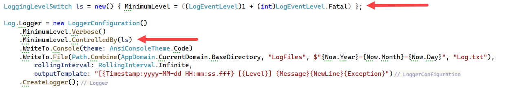

# About

The example demonstrates how to toggle logging using a property in appsettings.json along with a utility ConditionalLoggingToggle project which allows a user or engineer to toggle enabling or disabling logging.

The code to enable/disable logging is in SetupLogging class, since SeriLog does not have a property to enable/disable logging we use the following to disable logging.



An alternate solution is to use a settings file and use similar logic as in `ConditionalLoggingToggle` project for `ConditionalLogging` application.

```json
{
  "Serilog": {
    "MinimumLevel": {
      "Default": "6" /* disable logging */
    },
    "WriteTo": [
      {
        "Name": "File",
        "Args": {
          "path": ".\\LogFiles\\log.txt",
          "rollingInterval": "Day"
        }
      }
    ]
  }
}
```