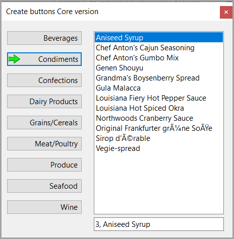

# Create dynamic buttons

No matter the year and the latest desktop technology novice developers gravitate to Windows Forms. One of the common experiments is to create many dynamic controls, usually buttons. The novice developer will have issues figuring out coordinates and leads to writing properties to Visual Studio’s output window or worst, MessageBox.

By using logging as demonstrated in this project properties are written to a log file. Once the log file has been created traverse to the file, right click and open with Visual Studio Code, keep it open to check values. Why not open directly in Visual Studio? Because Visual Studio will alert the developer each time the log file changes.

For an experience developer the alternate is to step through code with breakpoints but then one needs to remember property values so logging is the better option.

## First version


## Second version



## Data operations

Note there is a `try/catch` which we can invoke by changing the connection string in `appsettings.json`. 

In the catch there are two options

Get the entire exception
```csharp
Log.Error(exception);
```

Get only the message

```csharp
Log.Error(exception.Message);
```

## One step farther

Look at [Serilog.Exceptions](https://www.nuget.org/packages?q=Serilog.Exceptions) packages for more on working with runtime exceptions
