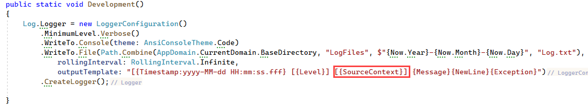

# About

Shows how to log to a file using `source contexts`.

A regular log for information

```
[2023-02-05 13:46:28.087 [Information] Hello from person
```

We have several classes in a project and want to tag logging with the class name, add `[{SourceContext}]` to the template as per below.




Now when logging as follows 

```csharp
internal partial class Program
{
    static void Main(string[] args)
    {
        AnsiConsole.MarkupLine("[yellow]Hello[/]");
        SetupLogging.Development();

        var personContext = Log.ForContext<Person>();
        personContext.Information("Hello from person");

        var customerContext = Log.ForContext<Customer>();
        customerContext.Information("Hello from customer");

    }
}
```

We end up with

```
[2023-02-05 13:46:28.087 [Information] [LogForContext.Person] Hello from person
[2023-02-05 13:46:28.096 [Information] [LogForContext.Customer] Hello from customer
```

# Different format

- Place message on a separate line
- Place location on a separate line

```
[14:19:29 Information] LogForContext.Models.Customer
Hello, world!
in method DoSomething at ./Models/Customer.cs:11
```

## Language extension

```csharp
public static class LoggerExtensions
{
    public static ILogger Here(
        this ILogger logger, 
        [CallerMemberName] string memberName = "", 
        [CallerFilePath] string sourceFilePath = "", 
        [CallerLineNumber] int sourceLineNumber = 0) =>
        logger
            .ForContext("MemberName", memberName)
            .ForContext("FilePath", sourceFilePath)
            .ForContext("LineNumber", sourceLineNumber);
}
```

## Setup SeriLog

```csharp
public class SetupLogging
{

    public static void Development()
    {
        var outputTemplate = 
            """
            [{Timestamp:HH:mm:ss} {Level}] {SourceContext}{NewLine}{Message}{NewLine}in method {MemberName} at {FilePath}:{LineNumber}{NewLine}{Exception}{NewLine}
            """;
        
        Log.Logger = new LoggerConfiguration()
            .MinimumLevel.Verbose()
            .WriteTo.File(Path.Combine(AppDomain.CurrentDomain.BaseDirectory, "LogFiles", $"{Now.Year}-{Now.Month}-{Now.Day}", "Log.txt"),
                rollingInterval: RollingInterval.Infinite,
                outputTemplate: outputTemplate)
            .CreateLogger();

    }

}
```

## Write some information

```csharp
public class Customer
{
    private static Serilog.ILogger Log => Serilog.Log.ForContext<Customer>();

    public static void DoSomething()
    {
        Log.Here().Information("Hello, world!");
    }
}
```

Call DoSomething method:

```csharp
Customer.DoSomething();
```

**Note**
The following remove the full path for the call above placed in the project file.

```xml
<PropertyGroup>
   <PathMap>$([System.IO.Path]::GetFullPath('$(MSBuildThisFileDirectory)'))=./</PathMap>
</PropertyGroup>
```