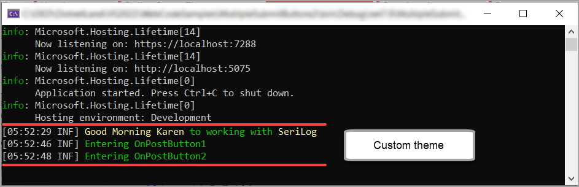

# About

**09-04-2024**

- Change theme
- Uses dependency injection to configure SeriLog rather than use Classes\SetupLogging.cs along with settings in appsettings.json

An example using SeriLog demonstrates

- Using a class to setup logging called in Program class
- How to create a custom theme, located in Classes\SeriLogCustomThemes

Run the application, click on the buttons then view the results for logging in the console window which will appear as shown below.

