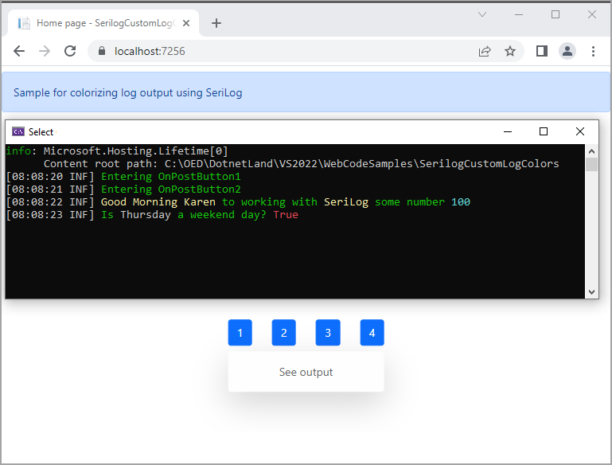

# About

Demonstrates customizing `Text` `String` `Number` and `Boolean` for writing to logs with SeriLog. Code to customize colors in in the class project `SeriLogLibrary`.

Current themes only customize foreground colors, if so inclined, you can customize background colors also.



There are currently two themes

```csharp
using Serilog.Sinks.SystemConsole.Themes;

namespace SeriLogLibrary;

public class SeriLogCustomThemes
{
    /// <summary>
    /// Custom theme.<br/>
    /// Text: Green<br/>
    /// String: Yellow<br/>
    /// Number: Cyan<br/>
    /// Boolean: Red<br/>
    /// </summary>
    public static SystemConsoleTheme Theme1()
    {
        Dictionary<ConsoleThemeStyle, SystemConsoleThemeStyle> customThemeStyles =
            new()
            {
                {
                    ConsoleThemeStyle.Text, new SystemConsoleThemeStyle
                    {
                        Foreground = ConsoleColor.Green,
                    }
                },
                {
                    ConsoleThemeStyle.String, new SystemConsoleThemeStyle
                    {
                        Foreground = ConsoleColor.Yellow,
                    }
                },
                {
                    ConsoleThemeStyle.Number, new SystemConsoleThemeStyle
                    {
                        Foreground = ConsoleColor.Cyan,
                    }
                },
                {
                    ConsoleThemeStyle.Boolean, new SystemConsoleThemeStyle
                    {
                        Foreground = ConsoleColor.Red, 
                    }
                }
            };
        
        return new SystemConsoleTheme(customThemeStyles);
    }

    /// <summary>
    /// Custom theme.<br/>
    /// Text: Green<br/>
    /// String: Yellow<br/>
    /// Number: Cyan<br/>
    /// Boolean: White<br/>
    /// </summary>
    public static SystemConsoleTheme Theme2()
    {
        Dictionary<ConsoleThemeStyle, SystemConsoleThemeStyle> customThemeStyles =
            new()
            {
                {
                    ConsoleThemeStyle.Text, new SystemConsoleThemeStyle
                    {
                        Foreground = ConsoleColor.Green,
                    }
                },
                {
                    ConsoleThemeStyle.String, new SystemConsoleThemeStyle
                    {
                        Foreground = ConsoleColor.Yellow,
                    }
                },
                {
                    ConsoleThemeStyle.Number, new SystemConsoleThemeStyle
                    {
                        Foreground = ConsoleColor.Cyan,
                    }
                },
                {
                    ConsoleThemeStyle.Boolean, new SystemConsoleThemeStyle
                    {
                        Foreground = ConsoleColor.White,
                    }
                },
            };

        return new SystemConsoleTheme(customThemeStyles);

    }
}
```

Usage

```csharp
public IActionResult OnPostButton2(IFormCollection data)
{
    Log.Information($"Entering {nameof(OnPostButton2)}");
    return new RedirectToPageResult("Index");
}

public IActionResult OnPostButton3(IFormCollection data)
{
    Log.Information("{TimeOfDay} {UserName} to working with {title} some number {number}", Howdy.TimeOfDay(), "Karen", "SeriLog", 100);
    return new RedirectToPageResult("Index");
}

public IActionResult OnPostButton4(IFormCollection data)
{
    Log.Information("Is {day} a weekend day? {IsWeekday} ",DateTime.Today.DayOfWeek,  DateTime.Now.IsWeekDay());
    return new RedirectToPageResult("Index");
}
```